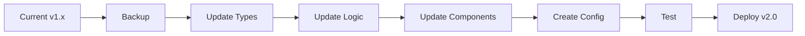

# 🎃 Migration Guide: From Equal Division to Request-Based Allocation

## Overview

This guide helps you transition the Halloween Candy Allocation Game from the original "equal division" mechanic to the new "request-based allocation" system with special children.

## What's Changing

### Old System (v1.x)
- Random round generation
- Divide candies equally among all children
- 10 points per correct round
- No differentiation between children
- Simple validation: quantity % children === 0

### New System (v2.0)
- Config-based rounds (all players get same questions)
- Each child has specific candy requests
- Special children earn 2x points
- Partial credit system (0, 0.5, 1, or 2 points per candy)
- Complex validation: match exact requests

## Migration Phases



## Phase 1: Backup Current State

### 1.1 Create Backup Branch

```bash
git checkout -b backup-v1.x
git commit -am "Backup before migration to v2.0"
git push origin backup-v1.x
git checkout main
```

### 1.2 Export Current Data

```sql
-- Backup existing game sessions
COPY (
  SELECT * FROM game_sessions 
  WHERE created_at >= NOW() - INTERVAL '30 days'
) TO '/tmp/game_sessions_backup.csv' CSV HEADER;
```

### 1.3 Document Current Metrics

Record these before migration:
- [ ] Total players
- [ ] Average score
- [ ] Completion rate
- [ ] Average time per round

## Phase 2: Update Type Definitions

### 2.1 Update [`src/types/game.types.ts`](src/types/game.types.ts:1)

**Add new interfaces:**

```typescript
// New interfaces to add
export interface Child {
  id: string;
  isSpecial: boolean;
  requests: CandyRequest[];
  emoji: string;
}

export interface CandyRequest {
  candyName: string;
  quantity: number;
}

export interface ChildAllocation {
  childId: string;
  allocatedCandies: AllocatedCandy[];
}

export interface AllocatedCandy {
  candyName: string;
  quantity: number;
}

export interface ChildResult {
  childId: string;
  isCorrect: boolean;
  isPartial: boolean;
  pointsEarned: number;
}

export interface RoundResult {
  roundNumber: number;
  pointsEarned: number;
  childResults: ChildResult[];
}

export interface GameConfig {
  gameSettings: {
    totalRounds: number;
    timeLimitPerRound: number;
    version: string;
  };
  rounds: GameRound[];
}
```

**Update existing interfaces:**

```typescript
// OLD GameRound
export interface GameRound {
  roundNumber: number;
  candies: CandyType[];
  childrenCount: number;
  timeLimit: number;
}

// NEW GameRound
export interface GameRound {
  roundNumber: number;
  initialCandies: CandyType[];  // Renamed from 'candies'
  children: Child[];             // Changed from number to array
  timeLimit: number;
}

// OLD GameState
export interface GameState {
  currentRound: number;
  totalRounds: number;
  score: number;
  rounds: GameRound[];
  playerNickname: string;
  timeRemaining: number;
  isGameOver: boolean;
  currentAllocation: AllocationInput[];
}

// NEW GameState
export interface GameState {
  currentRound: number;
  totalRounds: number;
  score: number;
  rounds: GameRound[];
  playerNickname: string;
  timeRemaining: number;
  isGameOver: boolean;
  currentAllocation: ChildAllocation[];  // Changed type
  roundResults: RoundResult[];            // New field
}
```

**Mark deprecated interfaces:**

```typescript
/**
 * @deprecated Use ChildAllocation instead
 */
export interface AllocationInput {
  candyName: string;
  perChild: number;
}
```

## Phase 3: Create New Utilities

### 3.1 Create [`src/utils/configLoader.ts`](src/utils/configLoader.ts:1)

```typescript
import type { GameConfig } from '../types/game.types';

/**
 * Load and validate game configuration
 */
export async function loadGameConfig(): Promise<GameConfig> {
  try {
    const response = await fetch('/game-config.json');
    if (!response.ok) {
      throw new Error('Failed to load game config');
    }
    const config: GameConfig = await response.json();
    validateGameConfig(config);
    return config;
  } catch (error) {
    console.error('Error loading game config:', error);
    throw error;
  }
}

/**
 * Validate game configuration structure
 */
function validateGameConfig(config: GameConfig): void {
  if (!config.gameSettings || !config.rounds) {
    throw new Error('Invalid config structure');
  }
  
  if (config.rounds.length === 0) {
    throw new Error('Config must have at least one round');
  }
  
  // Validate each round
  config.rounds.forEach((round, index) => {
    if (round.roundNumber !== index + 1) {
      throw new Error(`Round ${index + 1} has incorrect roundNumber`);
    }
    
    if (!round.initialCandies || round.initialCandies.length === 0) {
      throw new Error(`Round ${round.roundNumber} has no candies`);
    }
    
    if (!round.children || round.children.length === 0) {
      throw new Error(`Round ${round.roundNumber} has no children`);
    }
    
    // Validate candy references
    const candyNames = new Set(round.initialCandies.map(c => c.name));
    round.children.forEach(child => {
      child.requests.forEach(request => {
        if (!candyNames.has(request.candyName)) {
          throw new Error(
            `Round ${round.roundNumber}: Child ${child.id} requests unknown candy "${request.candyName}"`
          );
        }
      });
    });
  });
}
```

### 3.2 Create [`src/utils/scoringEngine.ts`](src/utils/scoringEngine.ts:1)

```typescript
import type { 
  Child, 
  AllocatedCandy, 
  ChildResult, 
  RoundResult,
  ChildAllocation 
} from '../types/game.types';

/**
 * Calculate points for a child's allocation
 */
export function calculateChildScore(
  child: Child,
  allocation: AllocatedCandy[]
): ChildResult {
  const pointsPerCorrectCandy = child.isSpecial ? 2 : 1;
  const pointsPerIncorrectCandy = 0.5;
  
  const isExactMatch = isAllocationExactMatch(child.requests, allocation);
  
  if (isExactMatch) {
    const totalCandies = child.requests.reduce(
      (sum, req) => sum + req.quantity, 
      0
    );
    return {
      childId: child.id,
      isCorrect: true,
      isPartial: false,
      pointsEarned: totalCandies * pointsPerCorrectCandy
    };
  }
  
  const hasAllocation = allocation.length > 0 && 
    allocation.some(a => a.quantity > 0);
  
  if (hasAllocation) {
    return {
      childId: child.id,
      isCorrect: false,
      isPartial: true,
      pointsEarned: pointsPerIncorrectCandy
    };
  }
  
  return {
    childId: child.id,
    isCorrect: false,
    isPartial: false,
    pointsEarned: 0
  };
}

/**
 * Check if allocation matches requests exactly
 */
function isAllocationExactMatch(
  requests: { candyName: string; quantity: number }[],
  allocation: AllocatedCandy[]
): boolean {
  if (requests.length !== allocation.length) return false;
  
  return requests.every(request => {
    const allocated = allocation.find(a => a.candyName === request.candyName);
    return allocated && allocated.quantity === request.quantity;
  });
}

/**
 * Calculate total round score
 */
export function calculateRoundScore(
  children: Child[],
  allocations: ChildAllocation[]
): RoundResult {
  const childResults = children.map(child => {
    const allocation = allocations.find(a => a.childId === child.id);
    return calculateChildScore(
      child,
      allocation?.allocatedCandies || []
    );
  });
  
  const totalPoints = childResults.reduce(
    (sum, result) => sum + result.pointsEarned,
    0
  );
  
  return {
    roundNumber: 0,
    pointsEarned: totalPoints,
    childResults
  };
}
```

### 3.3 Update [`src/utils/candyAllocation.ts`](src/utils/candyAllocation.ts:1)

**Add new validation function:**

```typescript
import type { CandyType, ChildAllocation } from '../types/game.types';

/**
 * Validate that allocations don't exceed inventory
 */
export function validateInventory(
  initialCandies: CandyType[],
  allocations: ChildAllocation[]
): { valid: boolean; errors: string[] } {
  const errors: string[] = [];
  
  const allocatedTotals = new Map<string, number>();
  
  allocations.forEach(childAlloc => {
    childAlloc.allocatedCandies.forEach(candy => {
      const current = allocatedTotals.get(candy.candyName) || 0;
      allocatedTotals.set(candy.candyName, current + candy.quantity);
    });
  });
  
  initialCandies.forEach(candy => {
    const allocated = allocatedTotals.get(candy.name) || 0;
    if (allocated > candy.quantity) {
      errors.push(
        `Not enough ${candy.name}: allocated ${allocated}, have ${candy.quantity}`
      );
    }
  });
  
  return {
    valid: errors.length === 0,
    errors
  };
}

/**
 * Calculate remaining candy after allocations
 */
export function calculateRemainingCandies(
  initialCandies: CandyType[],
  allocations: ChildAllocation[]
): CandyType[] {
  const allocatedTotals = new Map<string, number>();
  
  allocations.forEach(childAlloc => {
    childAlloc.allocatedCandies.forEach(candy => {
      const current = allocatedTotals.get(candy.candyName) || 0;
      allocatedTotals.set(candy.candyName, current + candy.quantity);
    });
  });
  
  return initialCandies.map(candy => ({
    ...candy,
    quantity: candy.quantity - (allocatedTotals.get(candy.name) || 0)
  }));
}
```

**Keep old functions for backward compatibility:**

```typescript
/**
 * @deprecated Use calculateChildScore instead
 */
export function validateAllocation(
  candies: CandyType[],
  childrenCount: number,
  allocation: AllocationInput[]
): boolean {
  // Keep old implementation for reference
  // Will be removed in v3.0
}
```

## Phase 4: Create New Components

### 4.1 Create [`src/components/game/ChildCard.tsx`](src/components/game/ChildCard.tsx:1)

```typescript
import type { Child, AllocatedCandy, CandyType, ChildResult } from '../../types/game.types';

interface ChildCardProps {
  child: Child;
  availableCandies: CandyType[];
  allocation: AllocatedCandy[];
  onChange: (allocation: AllocatedCandy[]) => void;
  disabled?: boolean;
  result?: ChildResult;
}

export default function ChildCard({
  child,
  availableCandies,
  allocation,
  onChange,
  disabled = false,
  result
}: ChildCardProps) {
  // Component implementation
  // See PIVOT_ARCHITECTURE.md for full details
}
```

### 4.2 Create [`src/components/game/CandyInventory.tsx`](src/components/game/CandyInventory.tsx:1)

```typescript
import type { CandyType } from '../../types/game.types';

interface CandyInventoryProps {
  initialCandies: CandyType[];
  remainingCandies: CandyType[];
}

export default function CandyInventory({
  initialCandies,
  remainingCandies
}: CandyInventoryProps) {
  // Component implementation
}
```

## Phase 5: Update Existing Components

### 5.1 Update [`src/components/game/GameBoard.tsx`](src/components/game/GameBoard.tsx:1)

**Key Changes:**

```typescript
// OLD: Random generation
const [rounds] = useState<GameRound[]>(() => 
  generateAllRounds(GAME_CONFIG.TOTAL_ROUNDS)
);

// NEW: Load from config
const [gameConfig, setGameConfig] = useState<GameConfig | null>(null);
const [rounds, setRounds] = useState<GameRound[]>([]);

useEffect(() => {
  loadGameConfig().then(config => {
    setGameConfig(config);
    setRounds(config.rounds);
  });
}, []);

// OLD: Per-candy allocation
const [allocation, setAllocation] = useState<AllocationInput[]>([]);

// NEW: Per-child allocation
const [allocations, setAllocations] = useState<ChildAllocation[]>([]);

// OLD: Simple scoring
if (isCorrect) {
  setScore(prev => prev + GAME_CONFIG.POINTS_PER_CORRECT);
}

// NEW: Complex scoring
const roundResult = calculateRoundScore(currentRound.children, allocations);
setScore(prev => prev + roundResult.pointsEarned);
```

### 5.2 Replace [`src/components/game/AllocationInputs.tsx`](src/components/game/AllocationInputs.tsx:1)

**Complete Rewrite Required:**

```typescript
// OLD interface
interface AllocationInputsProps {
  candies: CandyType[];
  allocation: AllocationInput[];
  onChange: (allocation: AllocationInput[]) => void;
}

// NEW interface
interface AllocationInputsProps {
  children: Child[];
  availableCandies: CandyType[];
  allocations: ChildAllocation[];
  onChange: (allocations: ChildAllocation[]) => void;
  disabled?: boolean;
}

// Implementation now renders ChildCard for each child
```

## Phase 6: Create Game Configuration

### 6.1 Create [`public/game-config.json`](public/game-config.json:1)

Use the example from [`GAME_CONFIG_GUIDE.md`](GAME_CONFIG_GUIDE.md:1) as a starting point.

### 6.2 Test Configuration

```bash
# Validate JSON syntax
npx jsonlint public/game-config.json

# Test loading in development
npm run dev
# Navigate to game and check browser console
```

## Phase 7: Database Migration

### 7.1 Update Schema

```sql
-- Add new columns
ALTER TABLE game_sessions 
ADD COLUMN IF NOT EXISTS average_points_per_round DECIMAL(4,2),
ADD COLUMN IF NOT EXISTS perfect_rounds INTEGER DEFAULT 0,
ADD COLUMN IF NOT EXISTS partial_rounds INTEGER DEFAULT 0,
ADD COLUMN IF NOT EXISTS config_version VARCHAR(10);

-- Optional: Create round results table
CREATE TABLE IF NOT EXISTS round_results (
  id UUID PRIMARY KEY DEFAULT uuid_generate_v4(),
  session_id UUID REFERENCES game_sessions(id),
  round_number INTEGER,
  points_earned DECIMAL(4,2),
  child_results JSONB,
  created_at TIMESTAMPTZ DEFAULT NOW()
);

-- Create index for performance
CREATE INDEX IF NOT EXISTS idx_round_results_session 
ON round_results(session_id);
```

### 7.2 Migrate Old Data (Optional)

```sql
-- Update config_version for old sessions
UPDATE game_sessions 
SET config_version = '1.0.0'
WHERE config_version IS NULL;

-- Calculate average points per round
UPDATE game_sessions 
SET average_points_per_round = ROUND(
  total_score::DECIMAL / NULLIF(rounds_completed, 0), 
  2
)
WHERE average_points_per_round IS NULL 
AND rounds_completed > 0;
```

## Phase 8: Update Constants

### 8.1 Update [`src/utils/constants.ts`](src/utils/constants.ts:1)

```typescript
// Mark as deprecated
/**
 * @deprecated Config now loaded from game-config.json
 */
export const GAME_CONFIG = {
  TOTAL_ROUNDS: 20,
  TIME_PER_ROUND: 40,
  // Keep for backward compatibility
  POINTS_PER_CORRECT: 10,
  MIN_CHILDREN: 2,
  MAX_CHILDREN: 5,
  MIN_CANDIES: 1,
  MAX_CANDIES: 20,
  MIN_CANDY_TYPES: 2,
  MAX_CANDY_TYPES: 3,
};

// Add new constants
export const SCORING = {
  REGULAR_CHILD_PER_CANDY: 1,
  SPECIAL_CHILD_PER_CANDY: 2,
  INCORRECT_ALLOCATION: 0.5,
  NO_ALLOCATION: 0,
};

export const SPECIAL_CHILD_INDICATOR = '👑';
```

## Phase 9: Testing Checklist

### 9.1 Unit Tests

```bash
# Create test files
- src/utils/__tests__/scoringEngine.test.ts
- src/utils/__tests__/configLoader.test.ts
- src/utils/__tests__/candyAllocation.test.ts
```

### 9.2 Integration Tests

- [ ] Config loads correctly
- [ ] Rounds display properly
- [ ] Children show with requests
- [ ] Special children marked
- [ ] Allocation validates inventory
- [ ] Scoring calculates correctly
- [ ] Timer works
- [ ] Round progression
- [ ] Game completion
- [ ] Leaderboard updates

### 9.3 User Acceptance Tests

- [ ] Play complete game
- [ ] Test on mobile
- [ ] Test on desktop
- [ ] Test different browsers
- [ ] Verify scoring accuracy
- [ ] Check UI responsiveness

## Phase 10: Deployment

### 10.1 Pre-deployment Checklist

- [ ] All tests passing
- [ ] Config file validated
- [ ] Database migrated
- [ ] Documentation updated
- [ ] Changelog created
- [ ] Version bumped to 2.0.0

### 10.2 Deployment Steps

```bash
# 1. Commit changes
git add .
git commit -m "feat: Migrate to request-based allocation v2.0"

# 2. Tag release
git tag -a v2.0.0 -m "Version 2.0.0: Request-based allocation"
git push origin main --tags

# 3. Deploy to Vercel
vercel --prod

# 4. Verify deployment
# Test production URL
```

### 10.3 Post-deployment Monitoring

Monitor for first 24 hours:
- [ ] Error rates
- [ ] Completion rates
- [ ] Average scores
- [ ] User feedback
- [ ] Performance metrics

## Rollback Plan

If critical issues arise:

### Quick Rollback

```bash
# 1. Revert to previous deployment
vercel rollback

# 2. Or deploy backup branch
git checkout backup-v1.x
vercel --prod
```

### Database Rollback

```sql
-- Remove new columns if needed
ALTER TABLE game_sessions 
DROP COLUMN IF EXISTS average_points_per_round,
DROP COLUMN IF EXISTS perfect_rounds,
DROP COLUMN IF EXISTS partial_rounds,
DROP COLUMN IF EXISTS config_version;

-- Drop new table if needed
DROP TABLE IF EXISTS round_results;
```

## Breaking Changes

### API Changes

| Old | New | Migration |
|-----|-----|-----------|
| `GameRound.candies` | `GameRound.initialCandies` | Rename field |
| `GameRound.childrenCount` | `GameRound.children[]` | Change to array |
| `AllocationInput[]` | `ChildAllocation[]` | New structure |
| `validateAllocation()` | `calculateChildScore()` | New function |
| Random generation | Config-based | Create config file |

### Component Props Changes

| Component | Old Props | New Props |
|-----------|-----------|-----------|
| AllocationInputs | `candies`, `allocation` | `children`, `availableCandies`, `allocations` |
| GameBoard | Generated rounds | Config-loaded rounds |
| CandyDisplay | Same | Same (no change) |

## Backwards Compatibility

### Keep for v2.0

These are kept but deprecated:
- `AllocationInput` interface (use `ChildAllocation`)
- `validateAllocation()` function (use `calculateChildScore`)
- `GAME_CONFIG` constants (use config file)

### Remove in v3.0

Plan to remove in future version:
- All deprecated interfaces
- Old validation functions
- Random generation utilities

## Communication Plan

### User Announcement

```markdown
🎃 **Major Game Update: Version 2.0!**

We're excited to announce a completely new gameplay experience!

**What's New:**
- Each child now has specific candy requests
- Special children (👑) earn bonus points!
- New scoring system with partial credit
- All players face the same challenges

**What Stays:**
- Same Halloween theme
- 40-second timers
- Global leaderboard
- No login required

**Scoring Changes:**
- Correct: 1-2 points per candy
- Partial: 0.5 points
- Wrong: 0 points

Your old high scores are safe! Try to beat them with the new system.
```

### Developer Notes

Update README.md with:
- Migration guide link
- Config file documentation
- New scoring explanation
- API changes
- Breaking changes list

## Timeline

Recommended migration schedule:

| Phase | Duration | Tasks |
|-------|----------|-------|
| Preparation | 1 day | Backup, plan, review |
| Development | 3-4 days | Types, utilities, components |
| Testing | 2 days | Unit, integration, UAT |
| Config Creation | 1 day | Design 10-20 rounds |
| Deployment | 1 day | Deploy, monitor, adjust |
| **Total** | **7-9 days** | |

## Success Metrics

Track these after migration:

### Technical Metrics
- [ ] Zero critical bugs in first week
- [ ] 99.9% uptime
- [ ] Page load < 2 seconds
- [ ] Config load < 500ms

### User Metrics
- [ ] Completion rate ≥ old system
- [ ] User engagement up 10%+
- [ ] Average session time maintained
- [ ] Positive user feedback

## Support Resources

### Documentation
- [`PIVOT_ARCHITECTURE.md`](PIVOT_ARCHITECTURE.md:1) - Technical architecture
- [`GAME_CONFIG_GUIDE.md`](GAME_CONFIG_GUIDE.md:1) - Config file reference
- [`README.md`](README.md:1) - User guide

### Code References
- Example migrations in git history
- Test files for reference
- Component examples

## Troubleshooting

### Common Issues

**Config not loading:**
```typescript
// Check browser console
console.error('Config load failed');
// Verify file exists at /game-config.json
// Check JSON is valid
```

**Scoring incorrect:**
```typescript
// Add debug logging
console.log('Child:', child);
console.log('Allocation:', allocation);
console.log('Result:', calculateChildScore(child, allocation));
```

**Inventory validation failing:**
```typescript
// Check total allocations
const result = validateInventory(initialCandies, allocations);
console.log('Validation:', result);
```

---

**Migration Version:** 1.0  
**Target Version:** 2.0.0  
**Last Updated:** 2025-10-28  
**Status:** Ready for Implementation