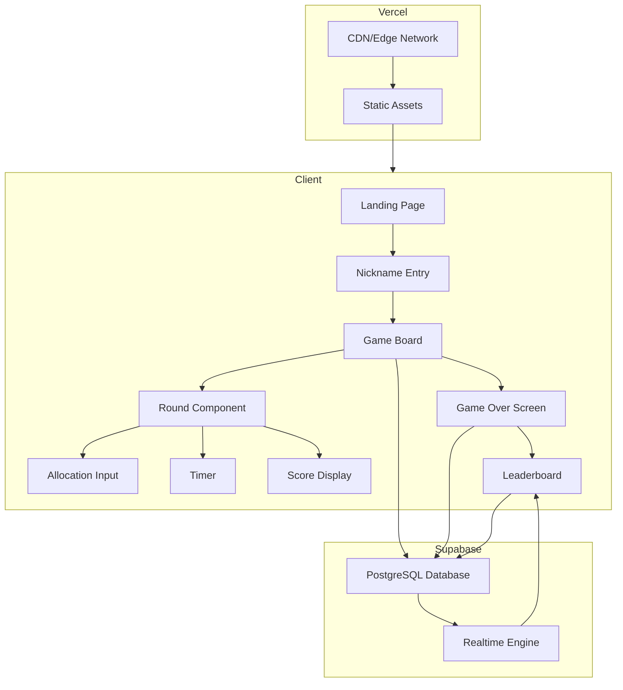
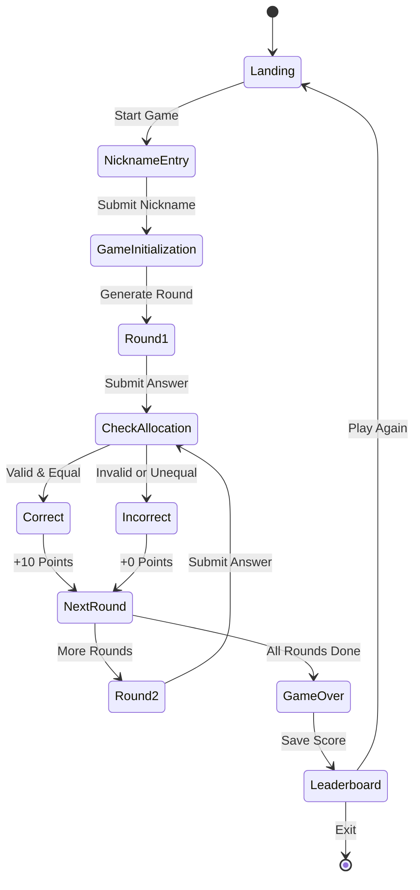

# Halloween Candy Allocation Game - Architecture Document

## Project Overview

A Halloween-themed web game where players must correctly allocate different types of candies equally among children. Players compete for high scores on a global leaderboard while racing against the clock.

### Core Concept
- Players receive candy allocation puzzles (e.g., Candy A: 3, Candy B: 2, Candy C: 6 for 3 children)
- Goal: Distribute each candy type equally among all children
- Rule: If candies cannot be divided equally, no allocation is made (0 for all)
- Each correct allocation earns 10 points
- 15-20 rounds per game session

## Technology Stack

### Frontend
- **Framework**: React 18 with TypeScript
- **Build Tool**: Vite (fast development and optimized production builds)
- **Styling**: Tailwind CSS (Halloween theme customization)
- **Animations**: anime.js (smooth transitions, candy movements, celebrations)
- **State Management**: React Context API + Hooks
- **Routing**: React Router v6

### Backend & Database
- **BaaS**: Supabase
  - PostgreSQL database for game sessions and leaderboard
  - Realtime subscriptions for leaderboard updates
  - Row Level Security (RLS) policies
  - Anonymous authentication support

### Deployment
- **Platform**: Vercel
  - Automatic SSL/HTTPS
  - Edge network for global performance
  - Environment variables management
  - CI/CD from Git repository

## Game Mechanics

### Game Rules

1. **Candy Allocation Logic**:
   ```typescript
   // Example: 3 candies of type A, 3 children
   // Correct allocation: 1 candy per child
   
   // Example: 5 candies of type B, 3 children
   // Correct allocation: 0 (cannot divide equally)
   
   // Example: 6 candies of type C, 3 children
   // Correct allocation: 2 candies per child
   ```

2. **Scoring**:
   - Correct allocation: +10 points
   - Incorrect allocation: 0 points
   - No partial credit

3. **Timer**:
   - 30-45 seconds per round (configurable)
   - Time bonus for quick answers (optional future feature)

4. **Game Session**:
   - 15-20 rounds total
   - Random candy types and quantities each round
   - Random number of children (2-5)

### Win Condition
- Complete all rounds
- Maximize score through correct allocations
- Compare with global leaderboard

## System Architecture



## Database Schema

### Tables

#### 1. game_sessions
```sql
CREATE TABLE game_sessions (
  id UUID PRIMARY KEY DEFAULT uuid_generate_v4(),
  player_nickname VARCHAR(50) NOT NULL,
  total_score INTEGER DEFAULT 0,
  rounds_completed INTEGER DEFAULT 0,
  total_rounds INTEGER DEFAULT 20,
  started_at TIMESTAMP WITH TIME ZONE DEFAULT NOW(),
  completed_at TIMESTAMP WITH TIME ZONE,
  session_data JSONB,
  created_at TIMESTAMP WITH TIME ZONE DEFAULT NOW()
);

CREATE INDEX idx_game_sessions_score ON game_sessions(total_score DESC);
CREATE INDEX idx_game_sessions_completed ON game_sessions(completed_at DESC);
```

#### 2. leaderboard (Materialized View)
```sql
CREATE MATERIALIZED VIEW leaderboard AS
SELECT 
  id,
  player_nickname,
  total_score,
  rounds_completed,
  completed_at,
  ROW_NUMBER() OVER (ORDER BY total_score DESC, completed_at ASC) as rank
FROM game_sessions
WHERE completed_at IS NOT NULL
ORDER BY total_score DESC, completed_at ASC
LIMIT 100;

CREATE UNIQUE INDEX idx_leaderboard_id ON leaderboard(id);
```

### Row Level Security (RLS)

```sql
-- Enable RLS
ALTER TABLE game_sessions ENABLE ROW LEVEL SECURITY;

-- Allow anonymous inserts and selects
CREATE POLICY "Allow anonymous insert" ON game_sessions
  FOR INSERT TO anon WITH CHECK (true);

CREATE POLICY "Allow public read" ON game_sessions
  FOR SELECT TO anon USING (true);

CREATE POLICY "Allow public read leaderboard" ON leaderboard
  FOR SELECT TO anon USING (true);
```

## Component Structure

```
src/
├── components/
│   ├── game/
│   │   ├── GameBoard.tsx           # Main game container
│   │   ├── RoundDisplay.tsx        # Current round info
│   │   ├── CandyDisplay.tsx        # Visual candy representation
│   │   ├── ChildrenDisplay.tsx     # Children avatars
│   │   ├── AllocationInput.tsx     # Input fields for allocation
│   │   ├── Timer.tsx               # Countdown timer
│   │   └── ScoreDisplay.tsx        # Current score
│   ├── screens/
│   │   ├── LandingPage.tsx         # Welcome screen
│   │   ├── NicknameEntry.tsx       # Player nickname input
│   │   ├── GameOverScreen.tsx      # Final results
│   │   └── Leaderboard.tsx         # Top scores
│   └── ui/
│       ├── Button.tsx              # Reusable button
│       ├── Card.tsx                # Container component
│       └── Modal.tsx               # Modal dialogs
├── hooks/
│   ├── useGameState.ts             # Game logic state
│   ├── useTimer.ts                 # Timer management
│   ├── useSupabase.ts              # Supabase operations
│   └── useAnimations.ts            # anime.js animations
├── utils/
│   ├── candyAllocation.ts          # Validation logic
│   ├── gameGenerator.ts            # Round generation
│   └── constants.ts                # Game constants
├── types/
│   ├── game.types.ts               # TypeScript interfaces
│   └── supabase.types.ts           # Database types
├── lib/
│   └── supabaseClient.ts           # Supabase configuration
├── styles/
│   └── globals.css                 # Tailwind + custom styles
├── App.tsx                         # Root component
└── main.tsx                        # Entry point
```

## Game Flow



## Core Game Logic

### Candy Allocation Validation

```typescript
interface CandyType {
  name: string;
  quantity: number;
  color: string;
}

interface AllocationInput {
  candyType: string;
  perChild: number;
}

function validateAllocation(
  candies: CandyType[],
  childrenCount: number,
  allocation: AllocationInput[]
): boolean {
  return allocation.every(input => {
    const candy = candies.find(c => c.name === input.candyType);
    if (!candy) return false;
    
    // Check if allocation is correct
    const expectedPerChild = candy.quantity % childrenCount === 0
      ? candy.quantity / childrenCount
      : 0;
    
    return input.perChild === expectedPerChild;
  });
}
```

### Round Generator

```typescript
interface GameRound {
  roundNumber: number;
  candies: CandyType[];
  childrenCount: number;
  timeLimit: number;
}

function generateRound(roundNumber: number): GameRound {
  const candyTypes = ['Lollipop', 'Chocolate', 'Gummy Bears', 'Candy Corn'];
  const numCandyTypes = Math.floor(Math.random() * 2) + 2; // 2-3 types
  const childrenCount = Math.floor(Math.random() * 4) + 2; // 2-5 children
  
  const selectedCandies = shuffleArray(candyTypes)
    .slice(0, numCandyTypes)
    .map(name => ({
      name,
      quantity: Math.floor(Math.random() * 20) + 1, // 1-20 candies
      color: getCandyColor(name)
    }));
  
  return {
    roundNumber,
    candies: selectedCandies,
    childrenCount,
    timeLimit: 40 // seconds
  };
}
```

## Animations with anime.js

### Key Animation Moments

1. **Candy Entrance**: Candies float in from top
2. **Children Entrance**: Children walk in from sides
3. **Allocation Feedback**: 
   - Correct: Candies fly to children with celebration
   - Incorrect: Shake animation
4. **Score Update**: Number count-up animation
5. **Round Transition**: Fade out/in with scale effect
6. **Game Over**: Fireworks for high scores

### Example Animation

```typescript
import anime from 'animejs';

function animateCandyToChild(candyElement: HTMLElement, childElement: HTMLElement) {
  const candyPos = candyElement.getBoundingClientRect();
  const childPos = childElement.getBoundingClientRect();
  
  anime({
    targets: candyElement,
    translateX: childPos.left - candyPos.left,
    translateY: childPos.top - candyPos.top,
    scale: 0.5,
    opacity: 0,
    duration: 800,
    easing: 'easeInOutQuad',
    complete: () => {
      // Show +10 points animation
      animatePoints(childElement);
    }
  });
}
```

## Tailwind Halloween Theme

```javascript
// tailwind.config.js
module.exports = {
  theme: {
    extend: {
      colors: {
        halloween: {
          orange: '#FF6B1A',
          purple: '#6B2D5C',
          black: '#1A1A1A',
          white: '#F5F5F5',
          green: '#4A7C59',
        }
      },
      fontFamily: {
        creepy: ['Creepster', 'cursive'],
        halloween: ['Nosifer', 'cursive'],
      },
      backgroundImage: {
        'halloween-pattern': "url('/halloween-bg.svg')",
      }
    }
  }
}
```

## Supabase Integration

### Client Configuration

```typescript
// lib/supabaseClient.ts
import { createClient } from '@supabase/supabase-js';

const supabaseUrl = import.meta.env.VITE_SUPABASE_URL;
const supabaseAnonKey = import.meta.env.VITE_SUPABASE_ANON_KEY;

export const supabase = createClient(supabaseUrl, supabaseAnonKey, {
  auth: {
    persistSession: false // Anonymous play
  }
});
```

### Game Session Management

```typescript
async function saveGameSession(
  nickname: string,
  score: number,
  rounds: number
) {
  const { data, error } = await supabase
    .from('game_sessions')
    .insert({
      player_nickname: nickname,
      total_score: score,
      rounds_completed: rounds,
      total_rounds: 20,
      completed_at: new Date().toISOString()
    })
    .select()
    .single();
  
  if (error) throw error;
  return data;
}

async function getLeaderboard(limit = 10) {
  const { data, error } = await supabase
    .from('game_sessions')
    .select('*')
    .not('completed_at', 'is', null)
    .order('total_score', { ascending: false })
    .order('completed_at', { ascending: true })
    .limit(limit);
  
  if (error) throw error;
  return data;
}
```

## Vercel Deployment

### Configuration Files

#### vercel.json
```json
{
  "buildCommand": "npm run build",
  "outputDirectory": "dist",
  "devCommand": "npm run dev",
  "installCommand": "npm install",
  "framework": "vite",
  "regions": ["sin1"],
  "env": {
    "VITE_SUPABASE_URL": "@supabase-url",
    "VITE_SUPABASE_ANON_KEY": "@supabase-anon-key"
  }
}
```

### Environment Variables
- `VITE_SUPABASE_URL`: Your Supabase project URL
- `VITE_SUPABASE_ANON_KEY`: Your Supabase anonymous key

### SSL/HTTPS
- Automatically handled by Vercel
- Custom domain support with auto SSL
- Force HTTPS redirect enabled by default

## Responsive Design

### Breakpoints
- **Mobile**: 320px - 640px (Single column, large buttons)
- **Tablet**: 641px - 1024px (Adapted layout)
- **Desktop**: 1025px+ (Full features, side-by-side)

### Mobile Optimizations
- Touch-friendly buttons (min 44px)
- Simplified animations for performance
- Optimized asset loading
- Progressive Web App (PWA) support

## Performance Optimizations

1. **Code Splitting**: Route-based lazy loading
2. **Image Optimization**: WebP format, lazy loading
3. **Bundle Size**: Tree shaking, minification
4. **Caching**: Service worker for offline support
5. **Database**: Indexed queries, materialized views
6. **CDN**: Vercel edge network

## Security Considerations

1. **Input Validation**: Sanitize nickname input
2. **Rate Limiting**: Prevent spam submissions (Supabase RLS)
3. **XSS Protection**: React's built-in escaping
4. **HTTPS**: Enforced by Vercel
5. **Environment Variables**: Never expose secrets in client

## Future Enhancements

- [ ] Multiple difficulty levels
- [ ] Power-ups and special candies
- [ ] Daily challenges
- [ ] Social sharing
- [ ] Sound effects toggle
- [ ] Theme customization
- [ ] Multiplayer real-time mode
- [ ] Achievement system
- [ ] Player profiles with login
- [ ] Mobile app version

## Development Workflow

1. **Local Development**: `npm run dev`
2. **Type Checking**: `npm run type-check`
3. **Linting**: `npm run lint`
4. **Build**: `npm run build`
5. **Preview**: `npm run preview`
6. **Deploy**: Push to GitHub → Auto-deploy to Vercel

## Testing Strategy

1. **Unit Tests**: Game logic validation
2. **Component Tests**: React Testing Library
3. **E2E Tests**: Playwright (optional)
4. **Manual Testing**: Cross-browser compatibility
5. **Performance Testing**: Lighthouse audits

---

## Implementation Phases

### Phase 1: Foundation (High Priority)
- Project initialization
- Tailwind setup
- Basic routing
- Supabase configuration

### Phase 2: Core Game (High Priority)
- Game logic implementation
- Round generation
- Allocation validation
- Score tracking

### Phase 3: UI Components (High Priority)
- Game board
- Input interface
- Timer
- Score display

### Phase 4: Integration (Medium Priority)
- Supabase integration
- Leaderboard
- Game session management

### Phase 5: Polish (Medium Priority)
- Animations
- Sound effects
- Responsive design
- Error handling

### Phase 6: Deployment (High Priority)
- Vercel configuration
- Environment setup
- Production testing

---

**Ready to build?** This architecture provides a solid foundation for creating an engaging, performant Halloween candy allocation game!