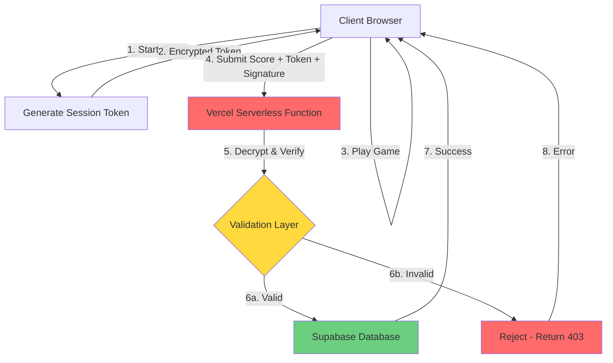

# Server-Side Security Architecture for Score Protection

## 🎯 Objective
Implement server-side proxy with encryption to prevent score manipulation in the Halloween Candy Game.

---

## 📐 Architecture Overview



---

## 🔐 Security Layers

### Layer 1: Session Token System
**Purpose:** Prevent replay attacks and track game sessions

**Implementation:**
- Server generates unique session token when game starts
- Token includes:
  - Timestamp (for expiration)
  - Random nonce (prevent guessing)
  - Game configuration hash (ensure using official config)
- Token signed with HMAC-SHA256
- Expires after game completion or 1 hour

**Flow:**
```
Client → GET /api/start-session
Server → Generates token, stores in memory/cache
Server → Returns encrypted token
Client → Stores token, includes in final submission
```

### Layer 2: Score Encryption
**Purpose:** Hide score data from network inspection

**Implementation:**
- Client encrypts score payload using AES-256-GCM
- Encryption key derived from session token + server secret
- Payload includes:
  - Player nickname
  - Total score
  - Rounds completed
  - Round-by-round data (for validation)
  - Timestamp
  - Session token

### Layer 3: HMAC Signature
**Purpose:** Ensure data integrity

**Implementation:**
- Client generates HMAC signature of encrypted payload
- Uses session token + server secret
- Server verifies signature before decryption
- Prevents tampering with encrypted data

### Layer 4: Server-Side Validation
**Purpose:** Verify score legitimacy

**Validation Checks:**
1. **Session Token Validation**
   - Token exists and not expired
   - Token not already used
   - Token matches submitted data

2. **Score Range Validation**
   - Score <= theoretical maximum (calculated from game config)
   - Score >= 0
   - Round count matches game config

3. **Timing Validation**
   - Time between session start and submission is reasonable
   - Minimum time per round (e.g., 5 seconds)
   - Maximum time reasonable (e.g., 2 hours)

4. **Round Data Validation**
   - Each round score within possible range
   - Round data matches game configuration
   - No impossible score combinations

5. **Rate Limiting**
   - Maximum submissions per IP: 10 per hour
   - Maximum submissions per nickname: 5 per day
   - Prevent spam and automated attacks

### Layer 5: Credential Protection
**Purpose:** Hide Supabase credentials from client

**Implementation:**
- Move Supabase URL and key to server environment variables
- Client never sees database credentials
- All database operations through server proxy

---

## 🛠️ Technical Implementation

### File Structure
```
/api
  ├── start-session.ts       # Generate session token
  ├── submit-score.ts        # Validate and save score
  ├── get-leaderboard.ts     # Public leaderboard (optional)
  └── utils/
      ├── crypto.ts          # Encryption utilities
      ├── validation.ts      # Score validation logic
      └── rateLimit.ts       # Rate limiting
/src
  ├── lib/
  │   ├── secureClient.ts    # Client-side encryption
  │   └── sessionManager.ts  # Session token handling
```

### API Endpoints

#### 1. POST `/api/start-session`
**Request:**
```json
{
  "gameVersion": "2.1.0",
  "configHash": "sha256_hash_of_config"
}
```

**Response:**
```json
{
  "sessionToken": "encrypted_token_here",
  "expiresAt": "ISO_timestamp",
  "maxScore": 150
}
```

#### 2. POST `/api/submit-score`
**Request:**
```json
{
  "sessionToken": "token_from_start",
  "encryptedPayload": "base64_encrypted_data",
  "signature": "hmac_signature"
}
```

**Encrypted Payload (before encryption):**
```json
{
  "nickname": "Player123",
  "totalScore": 120,
  "roundsCompleted": 15,
  "totalRounds": 15,
  "roundData": [
    {
      "roundNumber": 1,
      "pointsEarned": 8,
      "timestamp": "ISO_timestamp"
    }
  ],
  "timestamp": "ISO_timestamp",
  "sessionToken": "same_token"
}
```

**Response:**
```json
{
  "success": true,
  "rank": 5,
  "sessionId": "uuid"
}
```

**Error Response:**
```json
{
  "success": false,
  "error": "Invalid signature",
  "code": "INVALID_SIGNATURE"
}
```

#### 3. GET `/api/leaderboard`
**Query Params:** `?limit=10`

**Response:**
```json
{
  "entries": [
    {
      "rank": 1,
      "nickname": "Player123",
      "score": 145,
      "roundsCompleted": 15,
      "completedAt": "ISO_timestamp"
    }
  ]
}
```

---

## 🔧 Environment Variables

### Server-Side (.env or Vercel Environment)
```bash
# Supabase (Server-only)
SUPABASE_URL=your_supabase_url
SUPABASE_SERVICE_ROLE_KEY=your_service_role_key  # NOT anon key

# Security
SESSION_SECRET=random_256_bit_hex_string
ENCRYPTION_KEY=random_256_bit_hex_string
HMAC_SECRET=random_256_bit_hex_string

# Rate Limiting
MAX_SUBMISSIONS_PER_IP_PER_HOUR=10
MAX_SUBMISSIONS_PER_NICKNAME_PER_DAY=5
```

### Client-Side (Vite - .env)
```bash
# Nothing sensitive - all removed!
# Public URL only if needed
VITE_API_BASE_URL=/api  # Relative path to API
```

---

## 🔒 Encryption Details

### AES-256-GCM Encryption
```typescript
// Encryption (Client-side)
const encrypt = (data: object, key: string): string => {
  const iv = crypto.getRandomValues(new Uint8Array(12));
  const cipher = crypto.subtle.encrypt(
    { name: 'AES-GCM', iv },
    derivedKey,
    JSON.stringify(data)
  );
  return base64(iv + cipher);
};

// Decryption (Server-side)
const decrypt = (encrypted: string, key: string): object => {
  const [iv, cipher] = extractFromBase64(encrypted);
  const plaintext = crypto.subtle.decrypt(
    { name: 'AES-GCM', iv },
    derivedKey,
    cipher
  );
  return JSON.parse(plaintext);
};
```

### HMAC-SHA256 Signature
```typescript
// Client & Server
const sign = (data: string, secret: string): string => {
  return crypto.subtle.sign(
    'HMAC',
    importedKey,
    data
  ).then(signature => base64(signature));
};
```

---

## 📊 Rate Limiting Strategy

### In-Memory Cache (Simple)
```typescript
interface RateLimitEntry {
  ip: string;
  count: number;
  resetAt: number;
}

const rateLimitCache = new Map<string, RateLimitEntry>();

// Check on each request
const checkRateLimit = (ip: string): boolean => {
  const entry = rateLimitCache.get(ip);
  if (!entry || Date.now() > entry.resetAt) {
    rateLimitCache.set(ip, {
      ip,
      count: 1,
      resetAt: Date.now() + 3600000 // 1 hour
    });
    return true;
  }
  
  if (entry.count >= MAX_REQUESTS) {
    return false;
  }
  
  entry.count++;
  return true;
};
```

### Database-Based (Robust)
```sql
CREATE TABLE rate_limits (
  ip_address VARCHAR(45) PRIMARY KEY,
  request_count INTEGER DEFAULT 0,
  window_start TIMESTAMP DEFAULT NOW(),
  last_request TIMESTAMP DEFAULT NOW()
);

-- Clean up old entries
DELETE FROM rate_limits 
WHERE last_request < NOW() - INTERVAL '1 hour';
```

---

## 🧪 Validation Logic Example

```typescript
const validateScore = (payload: ScorePayload): ValidationResult => {
  const errors: string[] = [];
  
  // 1. Score range check
  const maxPossible = calculateMaxScore(payload.totalRounds);
  if (payload.totalScore > maxPossible) {
    errors.push(`Score ${payload.totalScore} exceeds maximum ${maxPossible}`);
  }
  
  if (payload.totalScore < 0) {
    errors.push('Score cannot be negative');
  }
  
  // 2. Round count check
  if (payload.roundsCompleted !== payload.totalRounds) {
    errors.push('Incomplete game session');
  }
  
  // 3. Time validation
  const timeTaken = new Date(payload.timestamp).getTime() - sessionStartTime;
  const minTime = payload.totalRounds * 5000; // 5 seconds per round minimum
  const maxTime = 7200000; // 2 hours maximum
  
  if (timeTaken < minTime) {
    errors.push(`Game completed too quickly (${timeTaken}ms)`);
  }
  
  if (timeTaken > maxTime) {
    errors.push('Session expired');
  }
  
  // 4. Round data validation
  const roundScoreSum = payload.roundData.reduce((sum, r) => sum + r.pointsEarned, 0);
  if (roundScoreSum !== payload.totalScore) {
    errors.push('Round scores do not match total score');
  }
  
  // 5. Individual round validation
  payload.roundData.forEach((round, index) => {
    const maxRoundScore = calculateMaxRoundScore(index + 1);
    if (round.pointsEarned > maxRoundScore) {
      errors.push(`Round ${round.roundNumber} score exceeds maximum`);
    }
  });
  
  return {
    isValid: errors.length === 0,
    errors
  };
};
```

---

## 🚀 Deployment Checklist

### Pre-Deployment
- [ ] Generate secure random keys for SESSION_SECRET, ENCRYPTION_KEY, HMAC_SECRET
- [ ] Set environment variables in Vercel dashboard
- [ ] Remove Supabase credentials from client `.env` files
- [ ] Update Supabase RLS policies to only allow service role
- [ ] Test API endpoints locally

### Deployment
- [ ] Deploy Vercel Serverless Functions
- [ ] Verify environment variables are set
- [ ] Test session creation endpoint
- [ ] Test score submission with valid data
- [ ] Test score submission with invalid data (should reject)
- [ ] Test rate limiting
- [ ] Monitor server logs for errors

### Post-Deployment
- [ ] Test from production URL
- [ ] Verify leaderboard displays correctly
- [ ] Check that direct Supabase submissions are blocked
- [ ] Monitor for any security issues
- [ ] Set up alerts for unusual activity

---

## 🛡️ Security Best Practices

1. **Never trust client data** - Always validate on server
2. **Use HTTPS only** - Enforce in production
3. **Rotate secrets regularly** - Every 90 days minimum
4. **Log security events** - Failed validations, rate limit hits
5. **Monitor for anomalies** - Sudden score spikes, unusual patterns
6. **Keep dependencies updated** - Regular security patches
7. **Use service role key on server** - Not anon key
8. **Implement CORS properly** - Only allow your domain

---

## 📈 Performance Considerations

### Optimization Strategies
